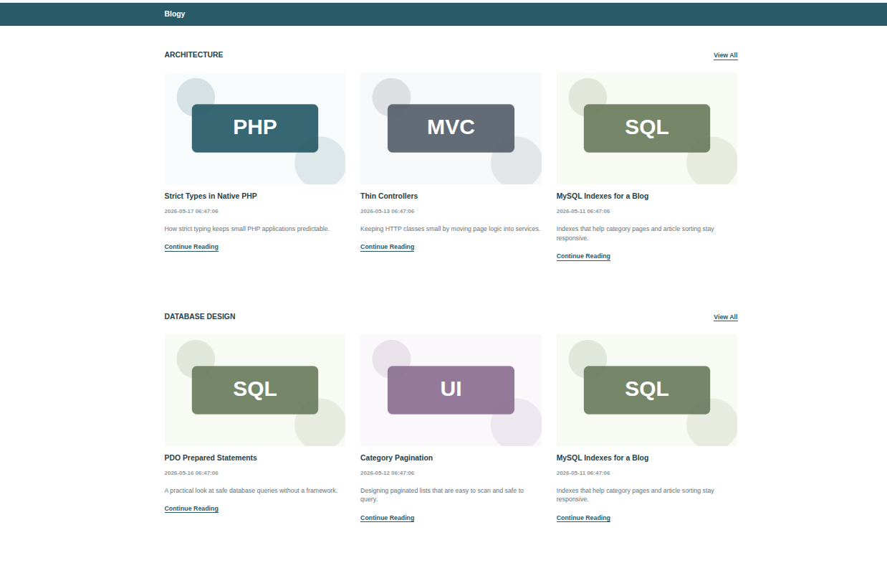

# Blog PHP Native

Блог на нативном PHP без фреймворков. В приложении есть главная страница с категориями и последними статьями, страницы категорий с сортировкой и пагинацией, страницы статей и блок похожих статей.

## Стек

- PHP 8.4
- MySQL 8.4
- nginx 1.30
- Smarty 5
- SCSS
- Docker Compose
- PHP_CodeSniffer
- PHPStan

## Запуск через Docker

1. Клонировать репозиторий:

```bash
git clone https://github.com/Andrey-Yurchuk/blog-php-native.git
cd blog-php-native
```

2. Создать `.env` из примера:

```bash
cp .env.example .env
```

3. Изменить значения в `.env`: задать `DB_PASSWORD`, `DB_ROOT_PASSWORD`, а также проверить `APP_PORT`, `DB_PORT`, `HOST_UID` и `HOST_GID`.

4. Собрать и запустить контейнеры:

```bash
docker compose up -d --build
```

5. Установить PHP-зависимости:

```bash
docker compose exec php composer install
```

6. Выполнить миграции:

```bash
docker compose exec php php bin/migrate
```

7. Заполнить базу тестовыми данными:

```bash
docker compose exec php php bin/seed
```

8. Установить зависимости для сборки SCSS:

```bash
docker compose run --rm node npm install
```

9. Собрать ассеты:

```bash
docker compose run --rm node npm run build
```

10. Открыть приложение:

```text
http://localhost:8080/
```

Если в `.env` изменен `APP_PORT`, нужно открыть приложение на выбранном порту.

## SCSS

`node`-контейнер нужен только для сборки ассетов и запускается отдельными командами, например `docker compose run --rm node npm run build`. При обычном `docker compose up -d` поднимаются контейнеры `php`, `nginx` и `mysql`.

Для запуска режима наблюдения за SCSS:

```bash
docker compose run --rm node npm run watch
```

## Проверки качества

Запуск PHP_CodeSniffer:

```bash
docker compose exec php composer cs
```

Запуск PHPStan:

```bash
docker compose exec php composer analyse
```

## Скриншот


